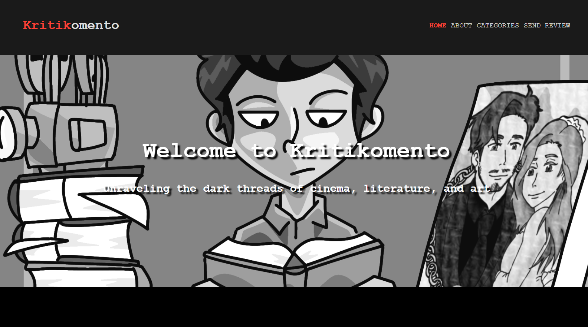
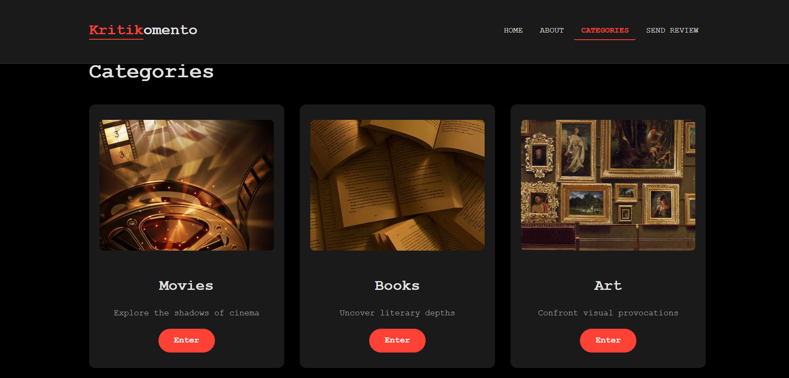
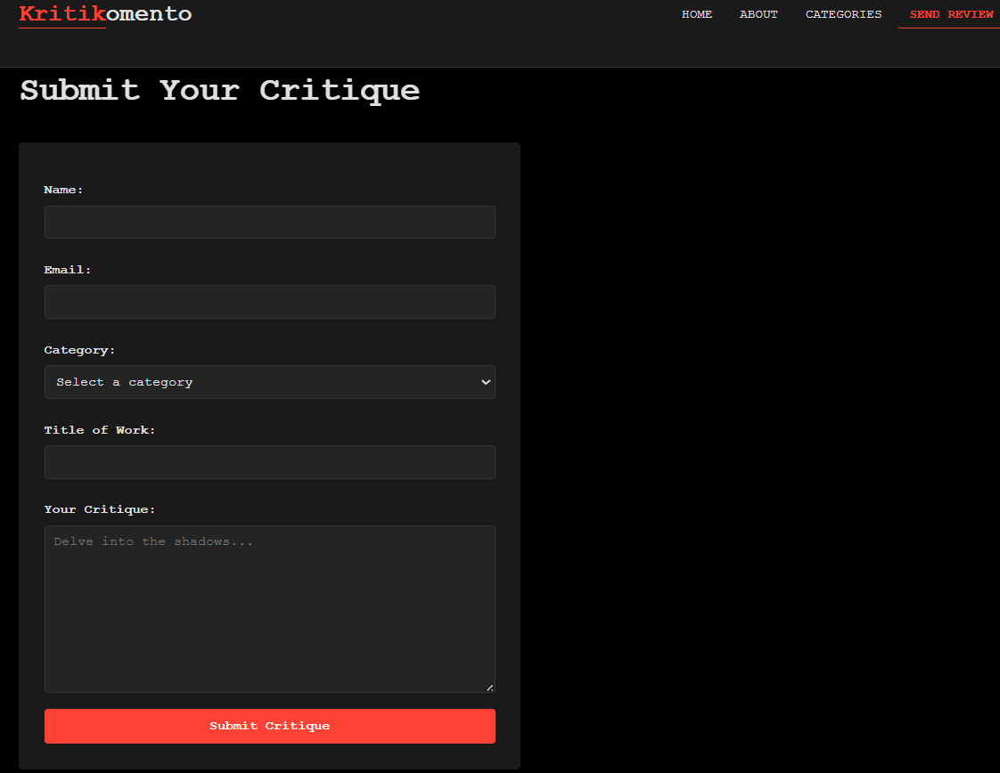

# 🎭 Kritikomento – Dark Critiques of Cinema, Literature & Art

**Kritikomento** is a static web platform dedicated to exploring the gritty, realistic, and often unsettling side of creative works. It provides a space for deep-dive reviews of movies, books, and visual art, all wrapped in a sleek, dark-themed interface. The name is a portmanteau of the Filipino word *"kritiko"* (critic) and *"komento"* (comment), reflecting its mission to spark thoughtful, unfiltered discussion.

---

# ✨ Key Features

- **Three Core Categories** – Movies, Books, and Art, each with a dedicated page.
- **Rich Review Cards** – Every entry includes a cover image, title, creator, concise critical summary, and rating.
- **Submit Your Own Critique** – A user-friendly review submission form (static demonstration).
- **Responsive & Accessible** – Optimised for desktop, tablet, and mobile devices, including reduced-motion support.
- **Modern UI Interactions** – Smooth page transitions, scroll-triggered animations, and elegant hover effects.
- **Dropdown Navigation** – Quick access to review categories directly from the navigation bar.

---

# 📸 Screenshots

## 1. Home Page – The Entrance



The homepage welcomes visitors with a dramatic background image and a bold statement:

> *"Unraveling the dark threads of cinema, literature, and art."*

It establishes the site's identity as a place for honest, thoughtful, and immersive criticism.

---

## 2. Categories Overview



The **Categories** page showcases the platform's three review sections:

- 🎬 Movies
- 📚 Books
- 🎨 Art

Each category is represented by a visually engaging card with hover animations that encourage exploration.

---

## 3. Submit Your Review



The **Send Review** page demonstrates how visitors can submit their own critiques through a clean, accessible HTML form.

It collects:

- Reviewer Name
- Email Address
- Category
- Work Title
- Review Content

Although this version is static, it is intentionally structured for future backend integration.

---

# 🖥️ User Flow

1. **Landing Page**
   - Users arrive on the homepage and learn the platform's purpose.

2. **Browse**
   - Navigate to:
     - About
     - Categories
     - Send Review
   - Or use the dropdown menu to jump directly into Movies, Books, or Art.

3. **Explore Reviews**
   - Browse review cards containing:
     - Cover Image
     - Creator
     - Rating
     - Short Review Summary

4. **Read More**
   - The current version is static, but every review card is designed to become a future dedicated review page.

5. **Submit a Review**
   - Visitors can submit critiques through the HTML5 validated form.

---

# 🧰 Technologies Used

| Technology | Purpose |
|------------|---------|
| **HTML5** | Semantic page structure |
| **CSS3** | Dark theme, responsive layouts, animations, hover effects |
| **JavaScript (Vanilla)** | Scroll animations, dropdown navigation, interactive behaviour |
| **Google Fonts** | Typography styling |

---

# 🚀 Getting Started (for Developers)

## 1. Clone the repository

```bash
git clone https://github.com/your-username/kritikomento.git
```

## 2. Open the project

Simply open **index.html** in your preferred web browser.

No installation, package manager, build tools, or local development server is required.

---

## 3. Customise

Replace the placeholder images located inside the **img/** folder with your own assets.

The HTML and CSS files are organised and commented for straightforward modification and expansion.

---

# 📌 Recommendations – Necessary Additions & Future Updates

To transform **Kritikomento** from a static portfolio project into a scalable review community platform, consider implementing the following enhancements.

---

# 🔴 Critical (Must-have)

| Task | Description |
|------|-------------|
| **Backend Integration** | Develop a backend using **Node.js/Express**, **Python/Django**, **PHP/Laravel**, or another framework to process submissions, store reviews in a database (PostgreSQL, MySQL, SQLite, or MongoDB), and dynamically serve review content. |
| **Review Detail Pages** | Replace static review cards with dedicated pages displaying the complete review, author, publication date, rating, and future comment sections. |
| **User Authentication** | Allow visitors to register, log in, edit their own reviews, and manage personal profiles. |
| **Input Sanitisation & Validation** | Protect against XSS, SQL Injection, CSRF, and other common web vulnerabilities by validating and sanitising all user input on both client and server sides. |

---

# 🟠 Important (Improves User Experience)

| Task | Description |
|------|-------------|
| **Search & Filtering** | Search reviews by title, category, author, rating, keywords, or publication date. |
| **User Ratings & Comments** | Enable community engagement through ratings, discussions, and threaded comments. |
| **Pagination / Infinite Scroll** | Improve loading performance for large review collections. |
| **Image Optimisation** | Use WebP/AVIF images, lazy-loading, responsive images, and optionally a CDN. |
| **Social Sharing** | Add share buttons for platforms like Facebook, X (Twitter), LinkedIn, Bluesky, or Reddit to increase visibility. |

---

# 🟢 Nice-to-have (Future Enhancements)

| Task | Description |
|------|-------------|
| **Dark / Light Theme Toggle** | Allow users to switch between dark and light themes while remembering their preference. |
| **Progressive Web App (PWA)** | Add offline support, installability, and native-like mobile behaviour. |
| **Analytics & Tracking** | Integrate Google Analytics, Plausible, or Matomo to understand visitor behaviour and popular content. |
| **Internationalisation (i18n)** | Support multiple languages such as English, Filipino, Spanish, and others. |
| **Rich Text Editor** | Replace the standard textarea with Quill, TinyMCE, CKEditor, or another WYSIWYG editor supporting formatting, images, and hyperlinks. |
| **Email Notifications** | Notify users about submitted reviews, approvals, replies, and comments. |
| **Moderation Dashboard** | Build an administrative dashboard for approving, editing, deleting, and moderating reviews and community discussions. |
| **Performance Optimisation** | Minify assets, compress responses (Gzip/Brotli), enable browser caching, and optimise Core Web Vitals. |
| **Accessibility (WCAG)** | Regularly audit accessibility using Lighthouse, axe DevTools, and screen-reader testing to ensure inclusive design. |

---

# 🛡️ Security & Maintenance

To maintain a secure and reliable platform:

- Use **HTTPS** across the entire website.
- Keep all dependencies and frameworks updated.
- Implement **rate limiting** on submissions to reduce spam and abuse.
- Regularly back up the application database.
- Enable CSRF protection for authenticated actions.
- Store passwords securely using modern hashing algorithms (such as Argon2 or bcrypt).
- Monitor logs for suspicious activity.
- Periodically perform security and dependency audits.

---

# 📄 License

This project is licensed under the **MIT License**.

You are free to use, modify, distribute, and build upon this project for personal or commercial purposes, provided that the original copyright notice and license are included.

See the **LICENSE** file for complete details.

---

# 🤝 Contributing

Although **Kritikomento** is primarily a personal portfolio project, constructive feedback and improvements are always appreciated.

Contributions are welcome through:

- Opening Issues
- Submitting Pull Requests
- Suggesting Features
- Reporting Bugs
- Improving Documentation

For major architectural or feature changes, please open a discussion first before submitting a large pull request.

---

# 🌟 Future Vision

Kritikomento aims to become more than a review website.

The long-term vision is to build an independent community where thoughtful criticism, artistic discussion, and meaningful conversation can flourish across literature, cinema, visual arts, and other creative media.

Future releases may include:

- Community profiles
- Reputation system
- Editorial recommendations
- Featured critics
- Review collections
- Bookmarks
- Reading history
- API integration
- Mobile application
- AI-assisted recommendations
- Community moderation tools

---

> **Kritikomento** — *because the best art doesn't comfort us; it challenges us.*

Made with ❤️ and a passion for critical thought.
